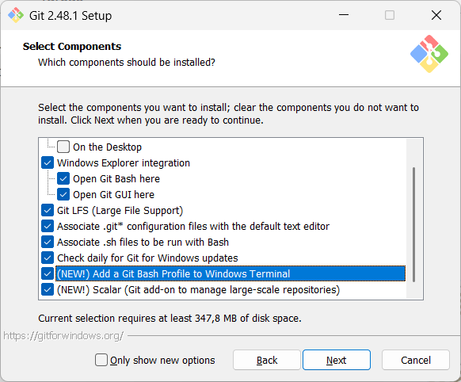
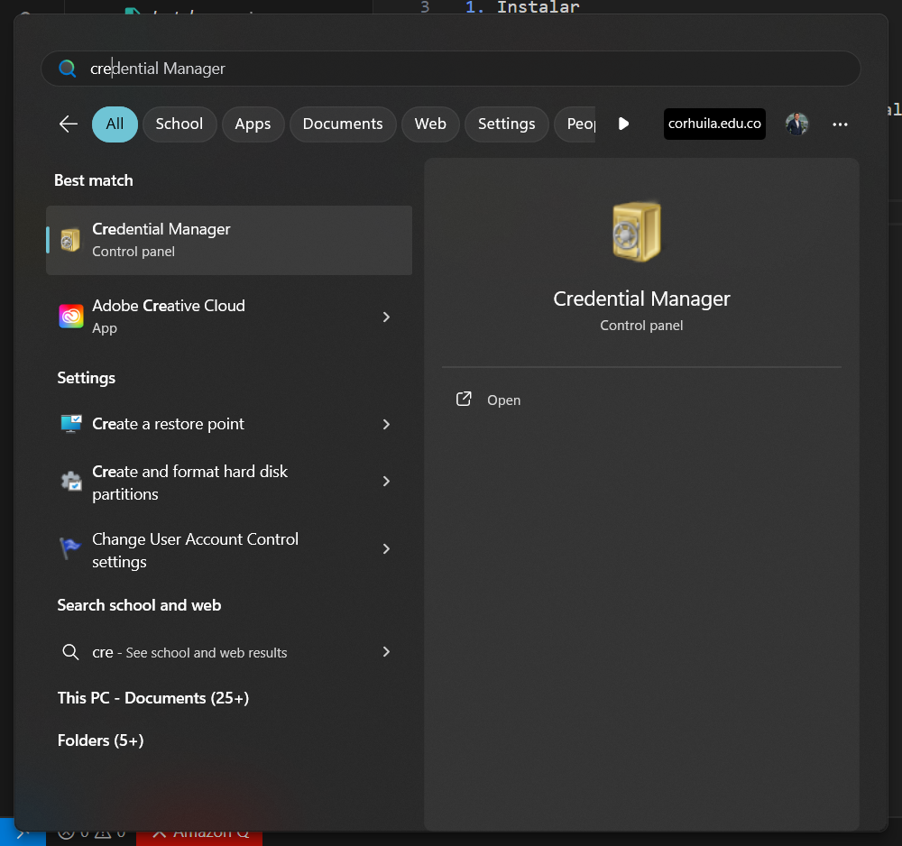
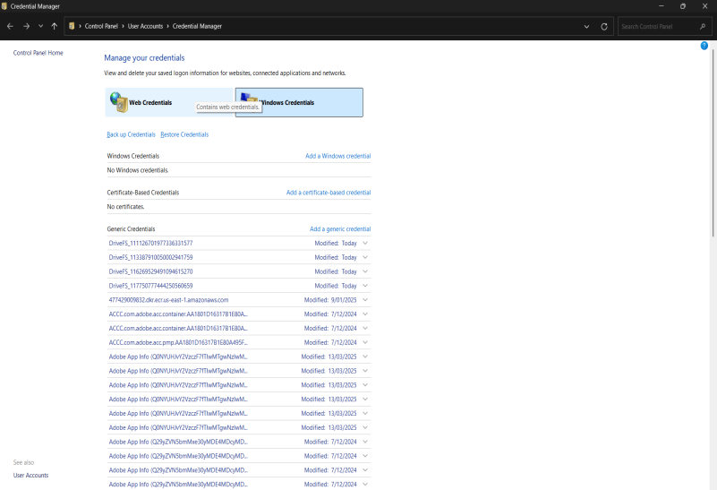
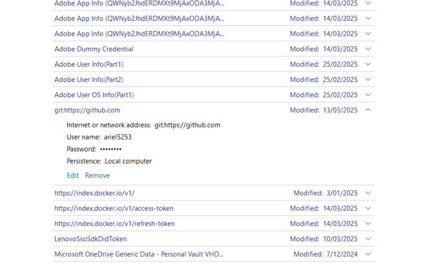

# Manual para configurar git

1. Instalar

2. Validar que windows esté sin credenciales de git
   
   * Ir a credenciales de windows
   
   

   * Ir a pestaña `credenciales de windows`
   
   

   * Buscar si hay usuario autenticado `remove`, si no corresponde a su usuario.
   
   

3. Autenticar cuenta y realizar cambios

   * Configurar valiables generales
   
      - `git config --global user.name "John Doe"`
      - `git config --global user.email johndoe@example.com`

4. Clonar repositorio y realizar cambios

   * Clonar    
      - `git clone https://github.com/code-corhuila/ciencia-datos-i-2025-a-g1.git`
  
  * Obtener últimos cambios    
      - `git pull`
  
  * Publicar cambios    
      - `git pull`
      - `git add .`
      - `git commit -m "Publicar comandos básicos de git."`
      - `git push`