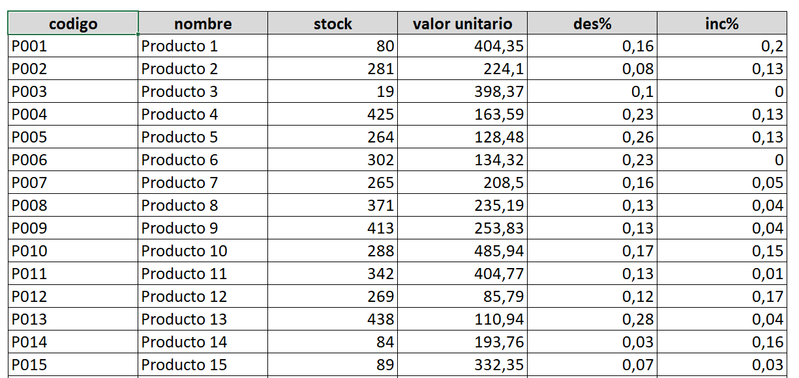
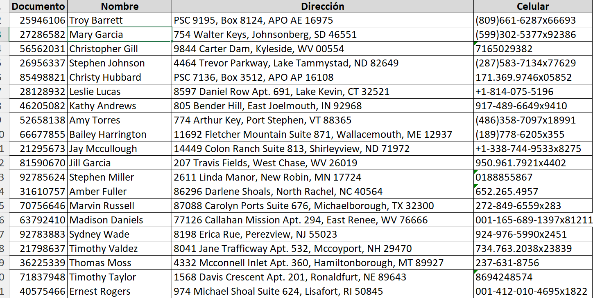
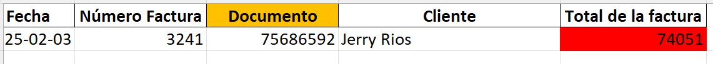
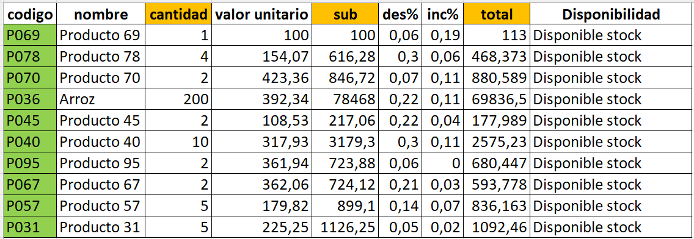

# Relacionales

- **Restricciones** 
  - **Primary Key**: Clave primaria, un campo o conjunto de campos que identifican de manera única una fila en una tabla.
  - **Foreign Key**: Clave foránea, un campo en una tabla que hace referencia a la clave primaria de otra tabla.

- **Tablas** 
  - Compuestas por **Filas** (Rows) y **Columnas** (Columns).

- **Interdependencia** 
  - Las tablas están interrelacionadas a través de claves primarias y foráneas, lo que permite establecer relaciones entre los datos de diferentes tablas.

# Fuentes

- **Documentos Excel**  
  Estructura de datos en Excel con tablas relacionadas:

  - **Producto**
    - `codigo`: Código único del producto (tipo: string)
    - `nombre`: Nombre del producto (tipo: string)
    - `stock`: Cantidad disponible del producto (tipo: entero)
    - `valor unitario`: Precio por unidad del producto (tipo: flotante)
    - `des%`: Porcentaje de descuento aplicado (tipo: flotante)
    - `inc%`: Porcentaje de incremento aplicado (tipo: flotante)
  
     

  - **Cliente**
    - `Nombre`: Nombre del cliente (tipo: string)
    - `Dirección`: Dirección del cliente (tipo: string)
    - `Documento`: Número de documento de identificación (tipo: entero)
    - `Celular`: Número de celular del cliente (tipo: string)

     

  - **Factura**
    - `Nit`: Número de identificación tributaria de la empresa (tipo: entero)
    - `Nombre empresa`: Nombre de la empresa (tipo: string)
    - `Fecha`: Fecha de emisión de la factura (tipo: fecha)
    - `Número Factura`: Número de factura (tipo: entero)
    - **Cliente**: Información del cliente que realiza la compra
      - `Nombre`, `Dirección`, `Documento`, `Celular`
  
     

    - **Lista de Productos**
      - `codigo`: Código del producto (tipo: string)
      - `nombre`: Nombre del producto (tipo: string)
      - `cantidad`: Cantidad de productos comprados (tipo: entero)
      - `valor unitario`: Precio por unidad del producto (tipo: flotante)
      - `sub`: Subtotal (cantidad * valor unitario) (tipo: flotante)
      - `des%`: Porcentaje de descuento aplicado (tipo: flotante)
      - `inc%`: Porcentaje de incremento aplicado (tipo: flotante)
      - `total`: Total después de aplicar descuentos e incrementos (tipo: flotante)
    - **Total de la factura**: Monto total de la factura (tipo: flotante)

     
    
# Motores de base de datos

- **SQL** (Structure Query Language) => **Lenguaje Estructurado de Consulta**
  - **DDL** (Data Definition Language): Definición de la estructura de la base de datos (crear, modificar, eliminar tablas y otros objetos).
  - **DML** (Data Manipulation Language): Gestión de los datos (insertar, actualizar, eliminar y consultar registros).
  
# No relacionales

(Se puede incluir más información según el tipo de base de datos no relacional a tratar, como documentos, clave-valor, etc.)